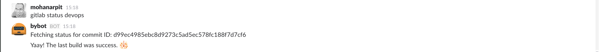
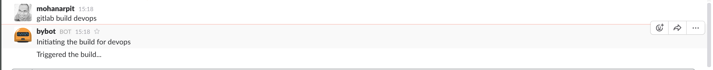

**How we got here?**

The world of Devops has been in constant flux over the last few years.
Everything about it has been contested, re-thought and re-done.
The profession of "System Administrators" was taken over by developers, given a new name, new tools and a completely new look.
The team that was earlier looked down upon suddenly became cool.
Now that more developers started to feel the brunt of the operations world,
more tools also came into being; Chef, Puppet, Ansible, Terraform to name a few.
In a short time, the number of new Devops tools started to rival the JS frameworks.

Even though the new tools brought upon good practices, the front-end was almost always a point-and-click system; especially build systems (read: Jenkins).
Now, with the advent of messaging systems and the rise of chatbots, we have a new front-end that we can integrate into: **Chat**.
The idea of [Chatops](https://speakerdeck.com/jnewland/chatops-at-github) was propagated by Github. It's a process that they've been practicing for a few years now. Infact, they even open-sourced [Hubot](https://hubot.github.com/), a life betterment robot around this idea. The end result?






**Wait, but why?**

Some of the advantages of this practice are:
* A universal interface that's familiar to everyone. No new softwares to learn.
* Provides a shared terminal akin to *tmux* or *screen*. Allows folks to debug more easily from a centralized place.
* Easy integrate into multiple other tools for monitoring, builds, deployment etc.

At [bicycle.ai](https://bicycle.ai), we are strong believers in the power of chat. Since messaging systems are our bread-and-butter,
we've tried to incorporate it into as many aspects of our life as possible. We now use Hubot in order to deploy our code.
Although Hubot has a lot of plugins, I found the gitlab plugin a little lacking. To this end, I've written a tiny plugin to fill in some of the gaps.
This is available [here](https://github.com/mohanarpit/hubot-gitlab-ci). I even ended up talking about it at a Devops conference recently. You can find the slide deck [here](../presentations/chatops-deck.html).

**Areas of improvement**

While tools like Hubot are a good step forward, it still feels like typing commands into a terminal.
Can we make it better? Hell yeah!

Advancements in NLP & Machine Learning effectively mean that we can start expressing our wishes in English and the bot should be able to understand and execute our command. This could mean that messages like
```
@hubot Please deploy the master branch to the staging environment
```
should result in exactly that. We are already at a stage wherein we can type such sentences to get the weather, request for stock prices, so why not actually perform our daily actions at work?

**What will it take for us to get there?**

We are already there. You can use services like [api.ai](https://api.ai), [wit.ai](https://wit.ai) etc to perform the NLP heavy-lifting for you and get back a structured JSON response. Your service/bot can parse the JSON response and take appropriate actions. All these services also offer a free-tier to experiment and get your feet wet before you go the whole hog.

Do give these services a spin and let me know what you think of this.
