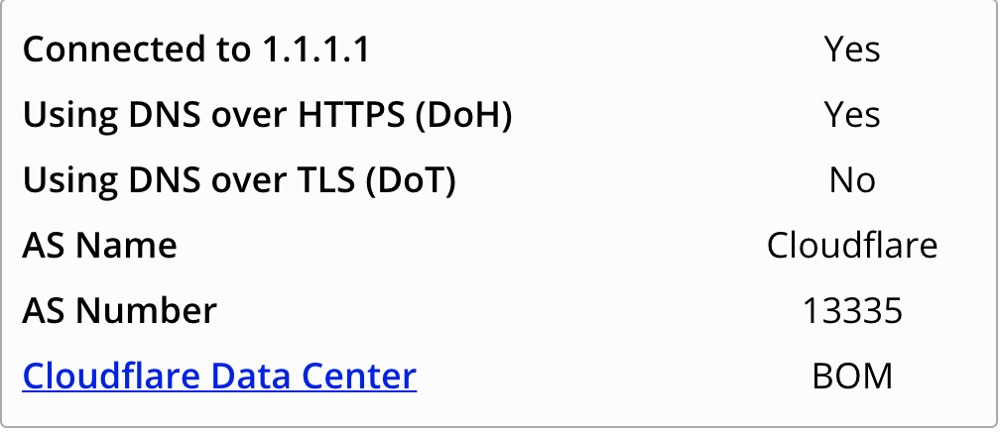

The DNS protocol has come under scrutiny in the last few years because it remains as one of the last bastions of unencrypted data transmission
over the network. There have been multiple proposals such as 
1. DNS over TLS 
2. DNSCurve
3. DNSCrypt

There is considerable consternation in the community over what standards must be employed. 
This post is not about those debates (which are best left to people who understand security and privacy issues much better than me). 
While the various camps may disagree strongly with each other, their end goal is the same: **DNS encryption**.

## Why DNS encryption matters?

Let's rewind back a little and talk about why this issue matters. As technology pervades more of our lives, our personal data is the "*new oil*". 
All firms, ranging from advertising networks, marketing agencies, credit rating companies etc are interested in our browsing patterns, reading patterns etc. 
A constant tussle between privacy concerns and legitimate business concerns has ensued in the industry.

The early web was built completely on text based protocols. As an observer, I could read all the data being transmitted over the wire in plain text. 
While this feature was great for debugging, it had it's own set of issues.
As the web grew, the ability to read data on the wire attracted malicious actors. They leveraged this feature for hacking while legitimate businesses 
used it to track users without consent. This led to the introduction of HTTPs. Now, all the data being transmitted on the wire was encrypted and it was no
longer easy to parse and interpret the data. 

Unfortunately, the DNS queries being made to resolve the URL to an IP was still being broadcast in plain text. ISPs, router firmwares, firewalls etc could 
still make really good guesses on what the user was attempting to do just by looking at the URL. As a user, if I opened `facebook.com`, I was most likely 
procrastinating. On the other hand, if I opened `stackoverflow.com`, I was most likely stuck on an issue. This makes DNS encryption important in our lives.
Once we start encrypting our DNS queries, middlewares can no longer interpret this data. 

Does it mean we are finally safe on the web? Absolutely NOT! You're never safe on the web.

If you'd like to understand the issue more deeply, please read [Mozilla's fantastic post](https://hacks.mozilla.org/2018/05/a-cartoon-intro-to-dns-over-https/).

## How to enable DNS Over HTTPS (DoH) in Google Chrome

While it's super simple to do this in Firefox (read [here](https://support.mozilla.org/en-US/kb/firefox-dns-over-https) for instructions), Chrome still hasn't made it very easy yet. This tutorial focuses on enabled DoH on Chrome on MacOSX.

1. Assuming you've installed Google Chrome via the DMG, you should be able to see your Chrome application installed in `/Applications/Google Chrome.app/Contents/`

2. Create a new file in `Contents` directory

        cd /Applications/Google Chrome.app/Contents/

        # Create new shell script to open Google Chrome with startup variables
        touch parameterized-chrome.sh
        vi parameterized-chrome.sh

3. Add the following in the shell script

        #!/usr/bin/env bash
        exec /Applications/Google\ Chrome.app/Contents/MacOS/Google\ Chrome \
        --enable-features="dns-over-https<DoHTrial" \
        --force-fieldtrials="DoHTrial/Group1" \
        --force-fieldtrial-params= \
        "DoHTrial.Group1:server/https%3A%2F%2F1.1.1.1%2Fdns-query/method/POST"

    These variables when provided to Chrome on startup enable the DNS Over HTTPS feature and connect to Cloudflare as a DNS resolver. Firefox also connects to 
    Cloudflare as their default DNS resolver for this feature.

4. Backup the `Info.plist` file. This is important incase you screw up and need to revert back to the original configuration.

5. Edit the `Info.plist` file. Find the section in the XML with the key: **CFBundleExecutable**. Edit the value from `Google Chrome` to `parameterized-chrome.sh`.

        #### Before making changes ####
        <key>CFBundleExecutable</key>
        <string>Google Chrome</string>

        #### After making changes ####
        <key>CFBundleExecutable</key>
        <string>parameterized-chrome.sh</string>

    Save and exit the file.

6. You need to reload the launch services in order for these changes to take effect. You can do this by running the following command.

        /System/Library/Frameworks/CoreServices.framework/Frameworks/LaunchServices.framework/Support/lsregister \
        -f /Applications/Google\ Chrome.app

7. Restart the chrome browser. 

8. In order to test if the settings have taken effect, visit the page: [https://1.1.1.1/help](https://1.1.1.1/help). Ideally, you should 
see the page claiming DNS Over HTTPS is enabled. A sample screenshot is attached below:

    

Enjoy your newfound security!